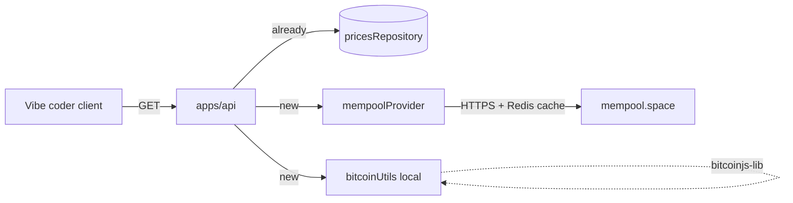

# Read-only base endpoints для вайб-кодеров

Базовый набор read-only эндпоинтов под аудиторию вайб-кодеров: 5 новых GET-роутов поверх внешних провайдеров (mempool.space) и существующего provider'а цены. Без записи, без своей on-chain инфры — последняя подключится позже без слома контрактов.

## Скоуп

5 новых GET-эндпоинтов + 1 уже существующий (`getCurrentPrice`). Все public, аноним = аутентифицированный без буста, лимиты — через существующий `x-default-rate-limit` (см. [API rate limits.md](./API%20rate%20limits.md)).

| operationId            | URL                                       | Источник на старте         | Будущий источник   |
| ---------------------- | ----------------------------------------- | -------------------------- | ------------------ |
| `getCurrentPrice`      | `GET /v1/prices/current` (уже есть)       | свой `pricesRepository`    | свой               |
| `convertPrice`         | `GET /v1/prices/convert`                  | свой `pricesRepository`    | свой               |
| `getAddressBalance`    | `GET /v1/addresses/:address/balance`      | mempool.space proxy        | electrs/ClickHouse |
| `getTransactionStatus` | `GET /v1/transactions/:txid/status`       | mempool.space proxy        | bitcoind RPC       |
| `validateAddress`      | `GET /v1/addresses/:address/validate`     | локально (`bitcoinjs-lib`) | то же              |
| `getPaymentUri`        | `GET /v1/addresses/:address/payment-uri`  | локально (BIP21)           | то же              |

`getPaymentUri` в MVP отдаёт только BIP21-строку (`bitcoin:<addr>?amount=...`). Рендер QR — на фронте. Картинку (PNG/SVG) — пост-MVP.

## Архитектура (гибридный источник)

Каждый внешний вызов прячется за **provider** в `apps/api/src/providers/` с Redis-кэшом (TTL 5–15s для balance/status, бесконечный для адрес-валидации). Когда поднимется своя инфра (см. [Bitcoin data infrastructure (Not ready).md](./Bitcoin%20data%20infrastructure%20%28Not%20ready%29.md), Фазы 2–5) — провайдер заменяется на repository поверх electrs/ClickHouse, контракт эндпоинта не меняется.

## Ключевые файлы

- Routes (filename = url, по правилу `api.mdc`):
  - `apps/api/src/routes/v1/prices/convert.ts` — новый
  - `apps/api/src/routes/v1/addresses/[address]/balance.ts` — новый (URL `/v1/addresses/:address/balance`)
  - `apps/api/src/routes/v1/addresses/[address]/validate.ts` — новый
  - `apps/api/src/routes/v1/addresses/[address]/payment-uri.ts` — новый
  - `apps/api/src/routes/v1/transactions/[txid]/status.ts` — новый
- Provider (внешние данные + кэш):
  - `apps/api/src/providers/mempool.provider.ts` — `getAddressBalance`, `getTransactionStatus`. Ходит на `https://mempool.space/api/...`, кэширует в Redis ключи `cache:mempool:balance:<addr>` (TTL 10s) и `cache:mempool:tx-status:<txid>` (TTL 10s). На 5xx/timeout — `BadGatewayError` с `code: UPSTREAM_UNAVAILABLE`.
- Локальные утилиты:
  - `apps/api/src/shared/bitcoin.ts` — `validateAddress(addr): { isValid, type? }` и `buildBip21Uri({ address, amount?, label?, message? })`. Используют `bitcoinjs-lib` (mainnet only в MVP).
- Зависимости (требуют апрува по правилу global):
  - `bitcoinjs-lib` — валидация адресов и BIP21. Альтернатива — `@scure/btc-signer`, легче. Уточнить перед стартом.
  - HTTP до mempool.space — встроенный `fetch`, ничего не добавляем.

## Контракты (минимум полей для DX)

Каждый эндпоинт — плоский JSON, никаких массивов "сырых" структур из mempool.space. Преобразуем в человеческий формат прямо в handler/provider.

- `getAddressBalance` → `{ address, confirmedSats, unconfirmedSats, totalSats }`
- `getTransactionStatus` → `{ txid, confirmed, blockHeight?, confirmations?, blockTime? }`
- `validateAddress` → `{ address, isValid, type? ("p2pkh" | "p2sh" | "p2wpkh" | "p2wsh" | "p2tr") }`
- `getPaymentUri` → `{ address, uri }`. Query: `?amount=&label=&message=` опциональны.
- `convertPrice` → `{ from, to, amount, result, rate, time }`. Query: `?from=BTC&to=USD&amount=0.5`. Rate берётся через `pricesRepository`.

Все ответы — AJV `JSONSchemaType<...>`, по правилу `api.mdc`.

## Как работают лимиты

Каждый роут обязан проставить `x-default-rate-limit` в schema (валидируется на `onReady`, см. [API rate limits.md](./API%20rate%20limits.md) Фаза 5). Стартовые числа (placeholders):

- `convertPrice`: 60/min
- `getAddressBalance`: 30/min (внешний upstream — щадим)
- `getTransactionStatus`: 60/min
- `validateAddress`: 120/min (локально, дёшево)
- `getPaymentUri`: 120/min (локально)

Утверждаем перед стартом.

## План выполнения (по фазам)

### Фаза 1. Зависимости и утилиты

- Подтвердить и добавить `bitcoinjs-lib` (или `@scure/btc-signer`).
- Создать `apps/api/src/shared/bitcoin.ts` с `validateAddress` и `buildBip21Uri`.

### Фаза 2. Провайдер mempool.space

- `apps/api/src/providers/mempool.provider.ts`:
  - `getAddressBalance(address)` → парсит `chain_stats` + `mempool_stats` из `/api/address/:address`.
  - `getTransactionStatus(txid)` → `/api/tx/:txid/status` + tip height для `confirmations`.
- Redis-кэш с TTL 10s, ключи `cache:mempool:balance:<addr>`, `cache:mempool:tx-status:<txid>`.
- Маппинг ошибок: 404 → `NotFoundError`, 5xx/timeout → `BadGatewayError(UPSTREAM_UNAVAILABLE)`.

### Фаза 3. Цены и конвертер

- Новый роут `convertPrice` поверх существующего `pricesRepository.getLastPrice(...)`.

### Фаза 4. Address-роуты

- `getAddressBalance`, `validateAddress`, `getPaymentUri` (порядок не важен, файлы независимые).

### Фаза 5. Transaction-роут

- `getTransactionStatus`.

### Фаза 6. Лимиты и финал

- Проставить `x-default-rate-limit` на каждом новом роуте.
- Прогнать `onReady`-валидацию (см. [API rate limits.md](./API%20rate%20limits.md) Фаза 5).
- Smoke-test каждого роута через `curl` на live API.

## Что НЕ делаем сейчас

- WS-стримы новых эндпоинтов (только REST). Стрим есть только у `getCurrentPrice`.
- Историю tx по адресу, UTXO, инфо о блоке, mempool stats — следующая итерация.
- Свою on-chain инфру — провайдер заменяется позже, контракт не ломается.
- QR как PNG/SVG картинку — пост-MVP.
- Testnet — пока mainnet only.
- Lightning, Ordinals, Runes — отдельные итерации.

## Открытые вопросы (решить до старта)

1. Подтвердить добавление `bitcoinjs-lib` (или `@scure/btc-signer`) в `apps/api`.
2. URL-конвенция: `/v1/addresses/:address/...` vs `/v1/address/:address/...`. Предлагаю `/v1/addresses/...` (REST plural).
3. Подтвердить значения `x-default-rate-limit` выше.
4. Формат `convertPrice`: только BTC↔fiat или ещё BTC↔sats? Если sats — нужен ли отдельный `/v1/utils/sats-to-btc`?
