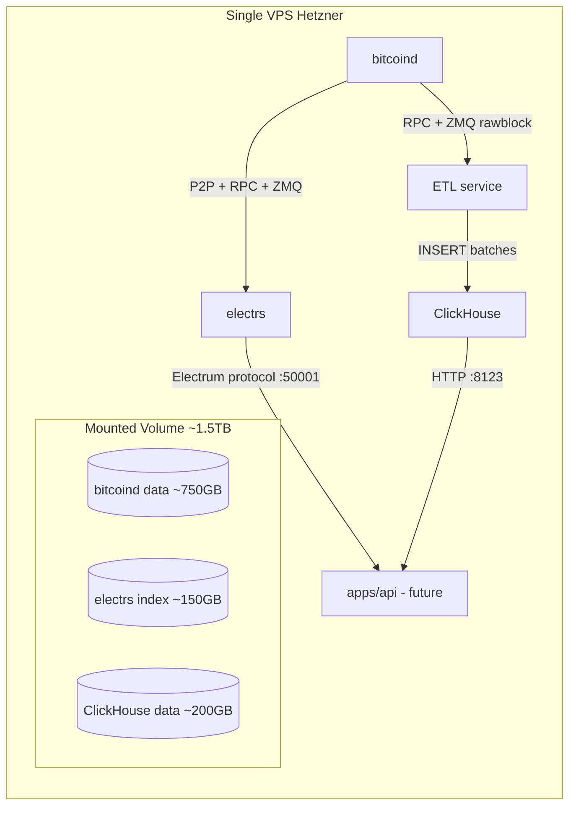

# Bitcoin data infrastructure (rough plan)

Инфраструктурный план. Не трогаем `apps/api` и `prisma/`.

## Архитектура



Источник истины — `bitcoind`. `electrs` — индекс адрес->транзакции. `ClickHouse` — аналитика. ETL гонит блоки из ноды в ClickHouse.

## Железо и volume

- **VPS**: 8 vCPU, 32GB RAM (Hetzner CCX23 ~€55/мес, или CX52 ~€30/мес как минимум)
- **Volume**: отдельный block storage **1.5-2TB NVMe**, смонтирован в `/data`
  - bitcoind: ~750GB (растёт ~50GB/год)
  - electrs index: ~150GB
  - ClickHouse: ~100-300GB (зависит от схемы и retention)
  - Запас 20-30%
- Структура: `/data/bitcoin`, `/data/electrs`, `/data/clickhouse`

## Компоненты — выбор и обоснование

### 1. bitcoind (Bitcoin Core)

- Версия: latest stable (29.x на момент плана)
- Деплой: официальный Docker образ или systemd unit (предпочту systemd для контроля, меньше overhead)
- Ключевые опции `bitcoin.conf`:
  - `txindex=1` (нужен electrs)
  - `server=1`, `rpcuser/rpcpassword` или `.cookie`
  - `zmqpubrawblock=tcp://127.0.0.1:28332`, `zmqpubrawtx=tcp://127.0.0.1:28333` (для real-time push в electrs и ETL)
  - `dbcache=4000` (4GB — ускорит initial sync)
- Initial sync: 1-3 дня

### 2. electrs (а не fulcrum)

**Почему electrs:** Rust, минимальный footprint, активно поддерживается mempool.space-командой, проще в эксплуатации. Fulcrum — C++, чуть быстрее на тяжёлых адресах, но избыточен для старта.

- Версия: `mempool/electrs` форк (он же используется на mempool.space, лучше ETA индексации и поддержка REST API в дополнение к Electrum protocol)
- Запуск: systemd unit, читает данные `bitcoind` через RPC + ZMQ
- Порты: `50001` (Electrum), `3000` (REST, опционально)
- Initial index: ~6-12 часов после готовности bitcoind

### 3. ClickHouse

- Версия: latest stable
- Деплой: официальный Docker образ или нативный пакет
- Конфиг: дефолты + `max_memory_usage`, выделить ~8-12GB RAM
- Доступ: только из localhost первое время, потом — через nginx/wireguard

### 4. ETL service (свой)

**Минималистичный Node.js worker** (TypeScript, ESM — в стиле проекта):

- Читает rawblock из ZMQ (`zeromq` npm пакет)
- Парсит блок (`bitcoinjs-lib` для парсинга tx)
- Батчит в ClickHouse (`@clickhouse/client` пакет)
- Хранит `last_processed_height` в самом ClickHouse (отдельная служебная таблица)
- При старте: catch-up от `last_processed_height` до текущего tip через RPC `getblock`, потом переключается на ZMQ live
- Reorg handling: при получении блока проверяет, что `prevhash` совпадает с последним сохранённым; если нет — откатывает N последних блоков и переиндексирует

Где жить: `apps/etl-clickhouse/` (новое приложение в monorepo, независимое от `apps/api`).

## ClickHouse — стартовая схема

Минимально — 3 таблицы. Развивать по мере появления конкретных запросов.

```sql
CREATE TABLE blocks (
    height UInt32,
    hash FixedString(64),
    prev_hash FixedString(64),
    timestamp DateTime,
    tx_count UInt32,
    size UInt32,
    weight UInt32
) ENGINE = ReplacingMergeTree()
ORDER BY height;

CREATE TABLE transactions (
    txid FixedString(64),
    block_height UInt32,
    block_time DateTime,
    fee UInt64,         -- sats
    size UInt32,
    vsize UInt32,
    input_count UInt16,
    output_count UInt16,
    total_in UInt64,    -- sats
    total_out UInt64    -- sats
) ENGINE = MergeTree()
ORDER BY (block_height, txid)
PARTITION BY toYYYYMM(block_time);

CREATE TABLE outputs (
    txid FixedString(64),
    vout UInt32,
    block_height UInt32,
    block_time DateTime,
    address String,     -- может быть пусто (OP_RETURN/нестандарт)
    value UInt64,       -- sats
    script_type LowCardinality(String)
) ENGINE = MergeTree()
ORDER BY (address, block_height)
PARTITION BY toYYYYMM(block_time);
```

`outputs` отсортированы по `address` — даёт быструю агрегацию по адресам без полного скана. Для lookup'ов по адресам всё равно живёт `electrs` — ClickHouse тут для аналитических `GROUP BY`.

## Безопасность

- Файрволл (`ufw`):
  - Открыто наружу: 22 (SSH), 8333 (P2P bitcoind, опционально)
  - Закрыто наружу: 8332 (RPC), 50001 (electrs), 8123/9000 (ClickHouse), 28332/28333 (ZMQ)
  - Доступ к закрытым — только через wireguard / SSH туннель пока нет интеграции
- bitcoind RPC через cookie auth (без пароля в конфиге)
- electrs и ClickHouse — bind на `127.0.0.1` только

## Бюджет (целевой)

- VPS: €30-55/мес
- Volume 2TB: ~€10/мес (Hetzner) — суммарно
- **Итого: ~€40-65/мес** против $500+/мес у CryptoQuant

## План выполнения (по фазам)

### Фаза 1. VPS + volume + базовая подготовка

- Заказать VPS, прикрутить volume, смонтировать в `/data`
- Базовая защита: ufw, fail2ban, обновления, отдельный non-root юзер
- Установить Docker (опционально) и systemd-юниты в один стиль

### Фаза 2. bitcoind

- Установить, конфиг с `txindex`, ZMQ, dbcache
- Запустить sync, дождаться 100% (мониторить через `bitcoin-cli getblockchaininfo`)
- Smoke test RPC и ZMQ (простой `zmq-sub` listener)

### Фаза 3. electrs

- Установить mempool/electrs, конфиг на bitcoind RPC + ZMQ
- Дождаться полного индекса
- Smoke test: запрос истории известного адреса (напр. genesis coinbase) через Electrum protocol (`electrum-cli` или `nc`)

### Фаза 4. ClickHouse

- Установить, накатить схему (`blocks`, `transactions`, `outputs`)
- Smoke test: пара INSERT/SELECT через `clickhouse-client`

### Фаза 5. ETL worker

- Создать `apps/etl-clickhouse/` (минимальный package.json, TypeScript ESM, как остальные apps)
- Зависимости (нужно подтверждение перед добавлением):
  - `zeromq` — ZMQ subscriber
  - `bitcoinjs-lib` — парсинг блоков/транзакций
  - `@clickhouse/client` — ClickHouse driver
- Логика: catch-up от last_height → ZMQ live → батч-инсерт каждые N секунд / M блоков
- systemd unit с auto-restart
- Smoke test: проверить, что counts в ClickHouse совпадают с `bitcoin-cli getblockchaininfo`

### Фаза 6. Бэкапы и мониторинг (минимально)

- Snapshot volume раз в неделю (Hetzner снапшоты)
- Простой healthcheck-скрипт: bitcoind tip == electrs tip == clickhouse last_height (±1 блок). Дискорд/email алерт при расхождении > 5 блоков
- `df -h /data` алерт при > 80%

## Что НЕ делаем сейчас

- Интеграция с `apps/api` (отдельная задача после готовности инфры)
- Endpoints, биллинг, rate-limit на новые роуты — это уже по образцу [API rate limits.md](./API%20rate%20limits.md) когда появятся конкретные роуты
- Replication / HA ClickHouse (один шард — хватит надолго)
- Mempool tracking в ClickHouse (добавим, когда понадобится)
- Pruning bitcoind (нельзя — `txindex` требует full)
- Lightning-данные

## Открытые вопросы перед стартом (не критично для плана, но решить до Фазы 5)

1. Подтвердить добавление зависимостей в `apps/etl-clickhouse`: `zeromq`, `bitcoinjs-lib`, `@clickhouse/client`.
2. Уточнить у Hetzner, есть ли локальный NVMe такого объёма или придётся брать сетевой volume (perf разница ~3-5x на random IO — критично для bitcoind initial sync).
3. Решить: ClickHouse в Docker или нативно (нативно — чуть проще тюнить, Docker — проще обновлять).
