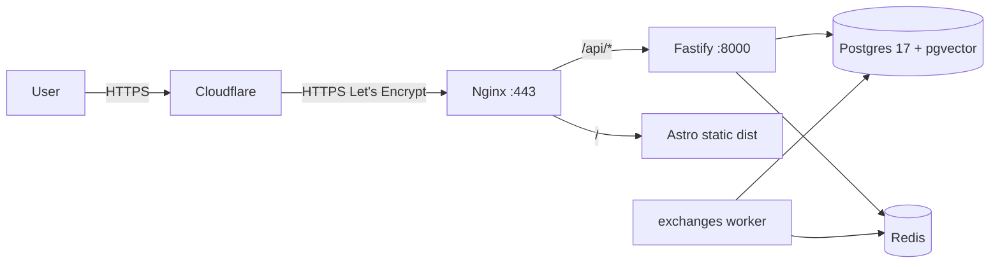

# Deploy Bitcoin API

Первичный деплой Bitcoin API на сервер: настройка ufw (Cloudflare-only), установка стека (Node 22, Postgres 17 + pgvector, Redis), сборка api/exchanges/web-client, конфигурация Nginx + certbot (DNS-01) как reverse proxy для bitcoin-api.net, systemd сервисы и Makefile-команды для последующих обновлений.

## Контекст

- Сервер: указан в `.env` (Hetzner, Ubuntu, root)
- Путь на сервере: `/root/bitcoin_api`
- Стек: Node 22, Postgres 17 + pgvector (PGDG repo), Redis, Fastify (API на :8000), Astro static (web-client), exchanges воркер
- Домен: `bitcoin-api.net` через Cloudflare (SSL/proxy on)
- Reverse proxy: **Nginx** + **certbot** с **Let's Encrypt** (DNS-01 challenge через Cloudflare API token, т.к. Proxy ON блокирует HTTP-01)
- CF SSL/TLS mode: **Full (strict)**

## Принцип: минимум привязки к Cloudflare

Стек спроектирован так, чтобы CF можно было выключить/заменить за минуты:

- **Сертификат** — Let's Encrypt, не CF Origin Cert (стандартный публичный CA, доверяется всеми браузерами напрямую без CF посередине)
- **DNS-01 plugin** — `python3-certbot-dns-cloudflare` сейчас, при миграции меняется на любой другой (`certbot-dns-route53`, `certbot-dns-digitalocean`, `certbot-dns-hetzner`, и т.д.) — `apt install` другого плагина + один токен
- **UFW Cloudflare-only allowlist** — единственное место с CF IP. При уходе с CF: `ufw allow 80,443/tcp` всем и удалить CF правила (одна команда)
- **Никаких CF Workers, R2, KV, Pages, Tunnel, Origin Cert** в архитектуре приложения

Сценарий миграции с CF (если потребуется):

1. Поменять nameservers домена у регистратора
2. Поменять certbot DNS плагин и креды (`/etc/letsencrypt/cloudflare.ini` → новый файл)
3. Открыть UFW для всех на 80/443

## Архитектура трафика



## DNS + CF setup (вручную в Cloudflare)

- `A bitcoin-api.net` → IP сервера, **Proxy ON**
- `A www.bitcoin-api.net` → IP сервера, Proxy ON
- SSL/TLS mode: **Full (strict)**
- Создать API token: My Profile → API Tokens → Create Token, permissions: `Zone:DNS:Edit` для зоны `bitcoin-api.net`. Сохранить токен (хранится в `.env` как `CF_API_KEY`).

---

## Шаги

### 1. UFW (Cloudflare-only) — следуя [.cursor/rules/shared/devops/ufw/cloudflare-access-only.mdc](../.cursor/rules/shared/devops/ufw/cloudflare-access-only.mdc)

На сервере:

- `ufw default deny incoming`
- `ufw default allow outgoing`
- `ufw allow 22/tcp` (SSH — иначе залочимся!)
- Скачать CF IPv4/IPv6 в `/tmp/cloudflare_ips_v{4,6}.txt`
- Применить allow для портов 80/443 только с CF IP (по примеру в правиле)
- `ufw enable`, `ufw status numbered`
- Postgres (5432) и Redis (6379) — НЕ открывать наружу (только localhost)

### 2. Системные пакеты

- `apt update && apt upgrade -y`
- `apt install -y curl git build-essential ca-certificates gnupg`
- Node 22: через NodeSource (`curl -fsSL https://deb.nodesource.com/setup_22.x | bash -` → `apt install -y nodejs`)
- Проверить `node -v` (>=22.12) и `npm -v` (>=10.9) per [package.json](../package.json) engines

### 3. Postgres 17 + pgvector (через PGDG)

- `apt install -y postgresql-common`
- `/usr/share/postgresql-common/pgdg/apt.postgresql.org.sh -y` (добавит PGDG репо)
- `apt install -y postgresql-17 postgresql-17-pgvector`
- `sudo -u postgres psql`:
  - `CREATE USER bitcoin_api WITH PASSWORD '<сильный пароль>';`
  - `CREATE DATABASE bitcoin_api OWNER bitcoin_api;`
  - `\c bitcoin_api` → `CREATE EXTENSION vector;`
- `pg_hba.conf` (`/etc/postgresql/17/main/pg_hba.conf`) — оставить локальные подключения (scram-sha-256), не трогать `listen_addresses`

### 4. Redis

- `apt install -y redis-server`
- `/etc/redis/redis.conf`: `bind 127.0.0.1`, `protected-mode yes`
- `systemctl enable --now redis-server`

### 5. Код проекта (уже на сервере в `/root/bitcoin_api`)

- `cd /root/bitcoin_api`
- `git pull` (на всякий, актуализировать)
- `git submodule update --init --recursive` (если ещё не сделано)
- `npm ci`
- Создать/проверить `/root/bitcoin_api/.env` (production версия, не из dev): новый `SECRET_KEY`, `ENVIRONMENT=production`, `NODE_ENV=production`, `DATABASE_URL=postgresql://bitcoin_api:<password>@localhost:5432/bitcoin_api`, `SITE_URL=https://bitcoin-api.net`, `PUBLIC_API_URL=https://bitcoin-api.net/api`, `GOOGLE_REDIRECT_URL=https://bitcoin-api.net/api/v1/auth/google/callback`, `CORS_ORIGIN=https://bitcoin-api.net`, прод `RESEND_API_KEY`/`GEMINI_API_KEY`/`GOOGLE_*`
- `chmod 600 .env`
- `npm run prisma:generate`
- `npm run prisma:push` (накатит схему + extensions + hnsw indexes)
- `npm run build` (TS build всех воркспейсов)
- `npm run build --workspace=apps/web-client` (Astro static → `apps/web-client/dist`)

### 6. Nginx + Let's Encrypt (certbot DNS-01 через Cloudflare API)

#### 6.1 Установка

- `apt install -y nginx certbot python3-certbot-dns-cloudflare`

#### 6.2 Получить LE сертификат через DNS-01

- Создать `/etc/letsencrypt/cloudflare.ini`:

```ini
dns_cloudflare_api_token = <CF_API_TOKEN>
```

- `chmod 600 /etc/letsencrypt/cloudflare.ini`
- Выпустить сертификат:

```bash
certbot certonly \
  --dns-cloudflare \
  --dns-cloudflare-credentials /etc/letsencrypt/cloudflare.ini \
  --dns-cloudflare-propagation-seconds 30 \
  -d bitcoin-api.net -d www.bitcoin-api.net \
  --agree-tos -m admin@bitcoin-api.net --non-interactive
```

- Сертификаты лягут в `/etc/letsencrypt/live/bitcoin-api.net/{fullchain,privkey}.pem`
- Auto-renewal: certbot ставит systemd timer `certbot.timer` автоматически — проверить `systemctl list-timers | grep certbot`. Renewal будет тоже через DNS-01 (метод запоминается).

#### 6.3 Nginx конфиг

`/etc/nginx/sites-available/bitcoin-api`:

```nginx
server {
    listen 80;
    listen [::]:80;
    server_name bitcoin-api.net www.bitcoin-api.net;
    return 301 https://$host$request_uri;
}

server {
    listen 443 ssl http2;
    listen [::]:443 ssl http2;
    server_name bitcoin-api.net www.bitcoin-api.net;

    ssl_certificate     /etc/letsencrypt/live/bitcoin-api.net/fullchain.pem;
    ssl_certificate_key /etc/letsencrypt/live/bitcoin-api.net/privkey.pem;
    ssl_protocols TLSv1.2 TLSv1.3;
    ssl_ciphers HIGH:!aNULL:!MD5;
    ssl_prefer_server_ciphers on;

    gzip on;
    gzip_types text/plain text/css application/json application/javascript text/xml application/xml application/xml+rss text/javascript;
    gzip_min_length 1024;

    root /root/bitcoin_api/apps/web-client/dist;
    index index.html;

    location /api/ {
        proxy_pass http://127.0.0.1:8000;
        proxy_http_version 1.1;
        proxy_set_header Host $host;
        proxy_set_header X-Real-IP $remote_addr;
        proxy_set_header X-Forwarded-For $proxy_add_x_forwarded_for;
        proxy_set_header X-Forwarded-Proto $scheme;
        proxy_set_header Upgrade $http_upgrade;
        proxy_set_header Connection "upgrade";
        proxy_read_timeout 300s;
        proxy_send_timeout 300s;
    }

    location / {
        try_files $uri $uri/ $uri.html /index.html;
    }
}
```

- `ln -s /etc/nginx/sites-available/bitcoin-api /etc/nginx/sites-enabled/`
- `rm /etc/nginx/sites-enabled/default`
- `nginx -t && systemctl reload nginx`

#### 6.4 Reload nginx после renewal

Certbot после renewal должен дёргать `nginx -s reload`. Создать `/etc/letsencrypt/renewal-hooks/deploy/nginx-reload.sh`:

```bash
#!/bin/bash
systemctl reload nginx
```

- `chmod +x /etc/letsencrypt/renewal-hooks/deploy/nginx-reload.sh`
- Тест: `certbot renew --dry-run`

### 7. systemd сервисы

Создать два юнита (per [.cursor/rules/shared/development/makefile.mdc](../.cursor/rules/shared/development/makefile.mdc) — `systemctl` для долгоживущих процессов):

`/etc/systemd/system/bitcoin-api.service`:

```ini
[Unit]
Description=Bitcoin API (Fastify)
After=network.target postgresql.service redis-server.service

[Service]
Type=simple
WorkingDirectory=/root/bitcoin_api/apps/api
EnvironmentFile=/root/bitcoin_api/.env
ExecStart=/usr/bin/node src/app.js
Restart=always
RestartSec=3
User=root

[Install]
WantedBy=multi-user.target
```

`/etc/systemd/system/bitcoin-exchanges.service` — аналогично, `ExecStart=/usr/bin/node src/last-price.app.js`, `WorkingDirectory=/root/bitcoin_api/apps/exchanges`.

- `systemctl daemon-reload`
- `systemctl enable --now bitcoin-api bitcoin-exchanges`
- Проверить: `systemctl status bitcoin-api bitcoin-exchanges`, `journalctl -u bitcoin-api -n 50`

### 8. Makefile команды для будущих апдейтов

Добавить в [Makefile](../Makefile) (по соглашению из правила — короткие имена `pb-*` = pull+build):

- `pb-api` — git pull, npm ci (если изменился lock), `npm run build`, `systemctl restart bitcoin-api`, sleep 5, status
- `pb-exchanges` — то же для `bitcoin-exchanges`
- `pb-web` — git pull, `npm run build --workspace=apps/web-client` (Nginx сам отдаст новые файлы)
- `pb-all` — git pull один раз, билд всего, restart обоих сервисов

### 9. Проверки

- `curl -I https://bitcoin-api.net` → 200 (web-client)
- `curl https://bitcoin-api.net/api/...` → ответ API (любой существующий health/route)
- В CF dashboard: Analytics показывает запросы
- `ufw status` → только 22 + CF IPs на 80/443
- `ss -tlnp | grep -E '5432|6379'` → bind только 127.0.0.1
- Прямой доступ `curl http://<IP>:443` с другого хоста → должен **зависнуть/timeout** (UFW режет не-CF)
