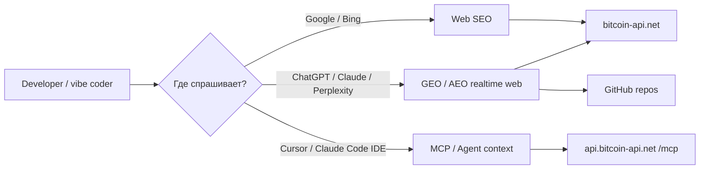
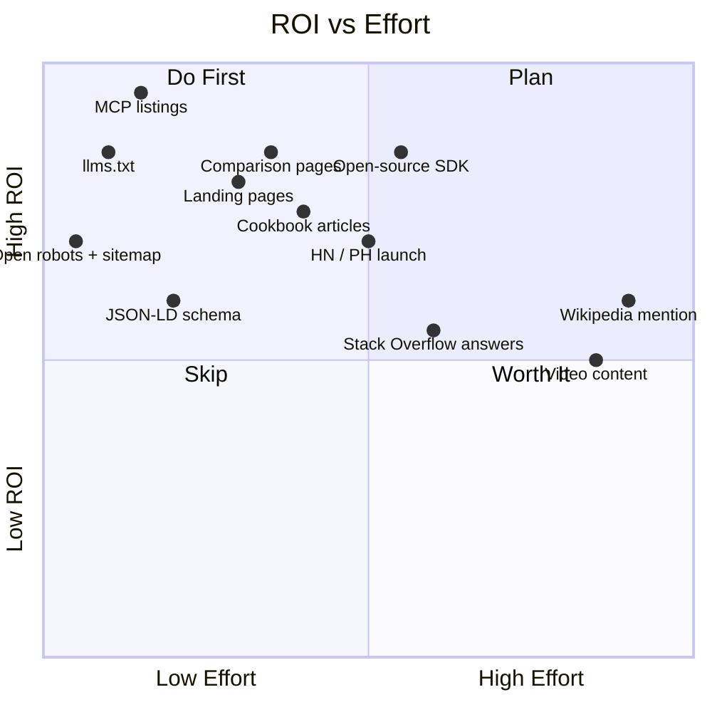

# SEO / GEO / AEO дорожная карта для Bitcoin API

Верхнеуровневая дорожная карта по тому, как сделать чтобы Bitcoin API находили и люди (SEO), и AI-ассистенты в чатах с веб-поиском (GEO/AEO), и AI-агенты в IDE (MCP). Этапы упорядочены по убыванию ROI: дешёвые/быстрые победы первыми, дорогая долгая игра — в конце.

## Контекст (из репо)

- Сайт `bitcoin-api.net`, Astro static, сейчас закрыт `X-Robots-Tag: noindex` в [Deploy.md](./Deploy.md) (nginx).
- Уже есть: документация (Astro Content Collections), traditional + AI search, **MCP сервер** на `/mcp` с тулзами `get_docs_list`, `get_doc`, `get_recipe`, `get_api_endpoints_list`, `api_endpoint` — см. [API docs search.md](./API%20docs%20search.md).
- ЦА (из [.cursor/rules/business.mdc](../.cursor/rules/business.mdc)): vibe coders, AI agents, developers. Vision — самая удобная DX Bitcoin API.

## Три канала, в которых нужно появиться

Канал 3 (MCP) — у нас сильное преимущество, вкладываемся в него агрессивнее, чем конкуренты.

---

## Этап 0. Pre-launch гигиена (день, обязательное условие)

Профит: без этого индексация не начнётся.

- Убрать `X-Robots-Tag: noindex` в nginx-конфиге из [Deploy.md](./Deploy.md) — выключатель для запуска.
- `robots.txt` (сейчас файл-плейсхолдер) — явно разрешить `GPTBot`, `ClaudeBot`, `PerplexityBot`, `Google-Extended`, `CCBot`, `Bingbot`. Эти имена сейчас критичны: они контролируют попадание контента в датасеты и в realtime-поиск AI.
- `sitemap.xml` (через `@astrojs/sitemap`).
- Канонические URL, `<meta description>`, OpenGraph/Twitter Card на каждой странице.
- Google Search Console + Bing Webmaster Tools — submit sitemap.

## Этап 1. Quick wins (1 неделя, максимальный ROI)

Профит: за дни появляемся в AI-ответах, потому что именно AI-каналы созревают быстрее классического Google.

1. **`llms.txt` и `llms-full.txt` в корне сайта.** Новый де-факто стандарт для LLM. Туда — позиционирование, ключевые эндпоинты, ссылки на cookbook'и, MCP-конфиг. Быстрая, но очень громкая победа.
2. **MCP — листинги.** Запушить в `mcp.so`, Smithery, `awesome-mcp-servers`, Cursor Directory, Claude Desktop community-listing. Это прямо в нашу ЦА. Минимум кода, максимум попадания в IDE-агентов.
3. **Landing-страницы под intent-запросы**, по которым AI-ассистенты сейчас отвечают в realtime:
   - `/bitcoin-api-for-cursor`
   - `/bitcoin-api-for-claude`
   - `/bitcoin-api-for-ai-agents`
   - `/bitcoin-price-api`
4. **Cookbook-формат на главной и в /docs.** Прямой ответ + `curl` пример в первых 5 строках страницы — модели любят такое цитировать дословно.
5. **JSON-LD schema** на ключевых страницах: `SoftwareApplication`, `APIReference`, `FAQPage`, `Organization`. Без этого AI-краулеры хуже извлекают факты.
6. **OpenAPI как публичный артефакт** — выложить `openapi.json` на стабильный URL. Многие AI-инструменты автоматически подсасывают OpenAPI.

## Этап 2. Контент и Github присутствие (2-4 недели)

Профит: попадание в датасеты будущих моделей + индексация.

1. **Open-source TS SDK** на GitHub — отдельный репо `bitcoin-api-net/sdk-ts`, MIT, published на npm. SDK = главный сигнал для моделей при обучении.
2. **MCP сервер как отдельный публичный пакет** `@bitcoin-api/mcp` (npx-able), даже если основной MCP живёт в нашей API — отдельный пакет нужен для `awesome-mcp` листингов и для оффлайн-юзкейсов.
3. **5-10 SEO-статей** в формате "How to X in Node/Python":
   - Get current BTC price
   - Stream BTC price via WebSocket
   - Bitcoin API vs BlockCypher / Mempool.space / CoinGecko / Blockchain.com (сравнения цитируются AI-ассистентами активнее всего)
4. **FAQ-страница** с 15-20 реальными вопросами developer-ов. `FAQPage` JSON-LD → попадание в AI Overviews и в SGE.
5. **Раздел "AI agent quickstart"** — прямо как для Cursor/Claude/Continue, копи-пейст конфиги.

## Этап 3. Внешние сигналы (1-3 месяца, дольше но ощутимее)

Профит: модели и поисковики смотрят на репутационные сигналы.

- Stack Overflow — отвечать на вопросы про bitcoin API, упоминать наш SDK когда это уместно.
- Reddit (`r/Bitcoin`, `r/BitcoinDev`, `r/programming`) — туториалы, не спам.
- dev.to / Hashnode / Medium — републикация cookbook'ов.
- Hacker News Show HN запуск (после готовности SDK + MCP).
- Product Hunt запуск.
- Гостевые посты в крипто/dev-блогах.
- Включение в кураторские списки: `awesome-bitcoin`, `awesome-crypto-apis`, `awesome-api`, `public-apis`.

## Этап 4. Долгая игра — попадание в обучение моделей (3-12 месяцев)

Профит: бесплатный поток рекомендаций от AI навсегда, но требует объёма и времени.

- GitHub stars (>500 — уверенный сигнал в датасетах).
- Wikipedia упоминание (тяжело, мощно, не торопиться).
- Backlinks с авторитетных доменов (npm download stats, GitHub trending, tech-блоги).
- Регулярный контент календарь — 1-2 поста в неделю минимум.
- Видео-контент (YouTube туториалы) — попадает в Google Discover и через transcripts в AI-обучение.

## Этап 5. Замеры (с самого начала)

Что должно быть, чтобы понимать что работает:

- Аналитика: Plausible/Umami (low-burn, GDPR-ок).
- Search Console + Bing Webmaster.
- Логирование AI-краулеров в nginx (`GPTBot`, `ClaudeBot`, `PerplexityBot`, `Google-Extended`) — отдельная метрика.
- MCP-телеметрия: счётчик использования каждой тулзы (уже есть `wrapToolHandlers` логирование — нужно агрегировать).
- Регулярный probe-тест: каждую неделю спрашивать ChatGPT/Claude/Perplexity "best Bitcoin API for Node.js" и логировать упоминания.

## Приоритет ROI vs усилия

## Что не делаем (осознанно)

- Никаких "SEO на 200 страниц AI-сгенерённого контента" — модели уже фильтруют такое, штрафует и Google.
- Не покупаем backlinks.
- Не делаем тяжёлый JS на ключевых лендингах — Perplexity и часть AI-краулеров не рендерят JS хорошо. Astro static нам тут на руку.
- Не плодим домены/поддомены под SEO.

## Следующий шаг

После апрува этого общего плана — берём **Этап 0 + Этап 1** и детализируем до конкретных файлов и шагов. Дальнейшие этапы детализируем по мере прохождения предыдущих, потому что приоритеты внутри Этапов 2-4 будут корректироваться по реальным метрикам из Этапа 5.
