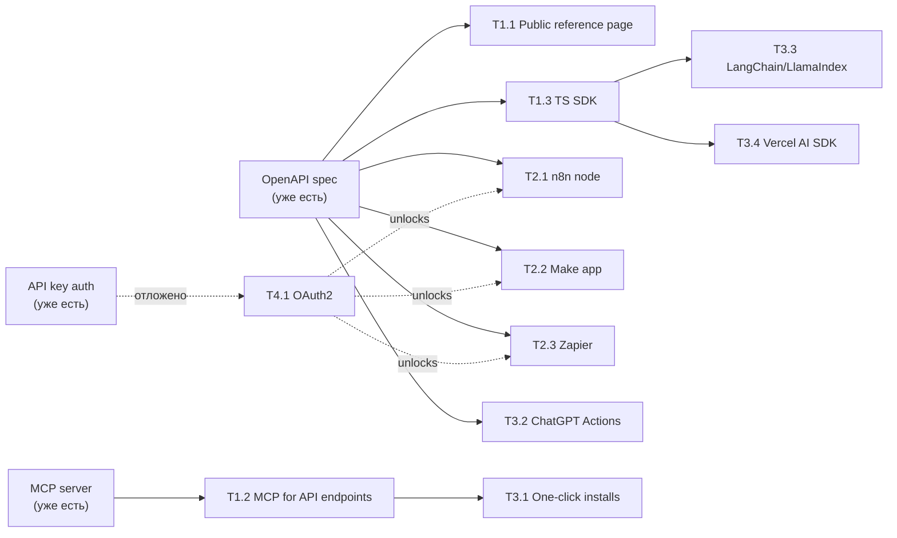

# Integrations roadmap (rough)

Грубый план интеграций Bitcoin API с внешними инструментами/платформами, отсортированный от самых дешёвых-простых-популярных к сложным-нишевым. Только верхнеуровнево: что, зачем, на чём строится, оценка трудозатрат. Без deep-dive в код.

## Что уже есть (фундамент)

- **OpenAPI 3.x** автогенерится из Fastify в [apps/api/files/openapi.json](../apps/api/files/openapi.json) (~19 эндпоинтов). Это база для половины интеграций ниже.
- **MCP server** уже работает на `/mcp` ([apps/api/src/mcp/](../apps/api/src/mcp/)) с тулзами для docs/recipes/api.
- **API key auth** ([apps/api/src/routes/v1/me/api-keys/](../apps/api/src/routes/v1/me/api-keys/)).
- **Docs site** на Astro с AI search и страницей `setup-mcp`.

Это сильно сокращает работу — большинство интеграций это упаковка существующего.

## Принципы выбора порядка

- **Цена входа**: хочешь low burn rate → начинаем с того, что бесплатно/почти бесплатно поддерживать.
- **ЦА**: vibe coders + AI agents + автоматизаторы → AI-инструменты и low-code приоритетнее enterprise iPaaS.
- **ROI на час работы**: одна OpenAPI спека открывает 5+ интеграций бесплатно.

## Tier 1 — must do, дешёвые и популярные у ЦА

- **1.1. Публичная OpenAPI спека на сайте** (~0.5 дня)
    - Уже генерится. Нужно только: эндпоинт `GET /openapi.json` на api + страница `/docs/api-reference` с Scalar/Redoc/Stoplight UI на сайте + кнопка "Download OpenAPI".
    - Открывает: импорт в Postman/Insomnia/Bruno одной кнопкой, n8n HTTP Request node (curl import), Cursor/Windsurf "import API", любые кодогенераторы клиентов.

- **1.2. MCP server — допилить и продвинуть** (~1-2 дня)
    - Текущего набора тулзов (поиск и чтение док, навигация по OpenAPI) достаточно. Агенты (Cursor/Claude/Windsurf) сами находят нужные эндпоинты и делают к ним HTTP-запросы. Делать отдельные тулзы под каждый API эндпоинт не нужно — это сильно раздувает контекст (system prompt) LLM.
    - Добавить варианты установки: `npx @bitcoinapi/mcp` обёртка (для тех у кого нет HTTP MCP), one-click ссылки `cursor://mcp/install`, deeplinks для Claude Desktop.
    - Это **главное оружие** для vibe coders — твоя ЦА.

- **1.3. TypeScript SDK** (~2-3 дня)
    - Сгенерить из OpenAPI через `openapi-typescript-codegen` или `orval`, опубликовать как `@bitcoinapi/sdk` на npm.
    - Тонкая обёртка: типы + fetch + auth helper. Никакой ручной работы — регенерится автоматом при изменении OpenAPI.
    - ЦА: классические разработчики, AI-агенты которые пишут TS код.

## Tier 2 — популярные low-code платформы

- **2.1. n8n community node** (~3-5 дней)
    - Пакет `n8n-nodes-bitcoin-api` на npm. Юзер ставит через Settings → Community Nodes.
    - Внутри: 1 credential (API key), N нод-операций (по одной на основной endpoint) или один generic node с операциями-выпадашкой.
    - Можно частично сгенерировать ноды из OpenAPI (есть тулзы типа `openapi-to-n8n`).
    - Подать заявку на **verified** статус → попадание в официальный маркетплейс n8n. Verified требует OAuth2 → отложено до Tier 4.
    - Хорошо потому что: n8n активно продвигает self-host у автоматизаторов и AI-агентов, low-code крутая ЦА.

- **2.2. Make.com Custom App** (~3-5 дней)
    - Создаётся в Make Developer Hub из OpenAPI (есть импортёр) + ручная доводка модулей.
    - Публикация: сначала **private app** (юзер вставляет ссылку-инвайт), потом верификация через Make для публичного маркетплейса. Верификация требует OAuth + поддержку.
    - Менее приоритетно чем n8n потому что Make platform закрытый, не self-host.

- **2.3. Zapier integration** (~5-7 дней)
    - Через Zapier Platform CLI или UI Builder. Тоже импорт из OpenAPI + триггеры/actions.
    - Публикация в Zapier App Directory требует: OAuth2, поддержку, минимум юзеров. Для invite-only тоже OAuth не обязателен, но желателен.
    - Ниже n8n/Make: Zapier это "буржуй-iPaaS", дорогой, аудитория не сильно пересекается с vibe coders.

## Tier 3 — AI/code-дев инструменты (точечные)

- **3.1. Cursor / Claude Desktop / Windsurf — one-click MCP install** (~0.5 дня)
    - Просто страницы-кнопки на сайте с deeplinks (`cursor://anysphere.cursor-deeplink/mcp/install?config=...`). Чистый маркетинг поверх Tier 1.2.

- **3.2. ChatGPT Custom GPT / Actions** (~1-2 дня)
    - GPT Actions едят OpenAPI напрямую. Делается публичный GPT "Bitcoin API Helper" — продвигает бренд + раздаёт лиды.
    - Низкая поддержка, высокий маркетинг-эффект.

- **3.3. LangChain / LlamaIndex tool packages** (~2-3 дня каждое)
    - Опубликовать `@bitcoinapi/langchain-tools` и `bitcoinapi-llamaindex` пакеты. Тонкие обёртки поверх SDK.
    - Опционально: PR в их официальные интеграции (`langchain-community`).

- **3.4. Vercel AI SDK tools** (~1 день)
    - `@bitcoinapi/ai-sdk-tools` — готовые tools для Vercel AI SDK. Сейчас популярно у Next.js вайбкодеров.

## Tier 4 — серьёзный и нишевый long-tail

- **4.1. OAuth2 server** (~5-7 дней) — разблокирует verified-статус в n8n/Make/Zapier и Custom GPT с user auth.
- **4.2. Python SDK** — генерится из OpenAPI, но требует отдельной публикации/поддержки на PyPI.
- **4.3. Go / Rust / Java SDK** — по запросу, нишево.
- **4.4. Pipedream components** — мелкая платформа, аудитория похожа на n8n.
- **4.5. Retool / Bubble / Webflow** — по запросу от enterprise юзеров.
- **4.6. Bolt / v0 / Lovable templates** — готовые стартеры приложений с твоим API. Маркетинг, не интеграция как таковая.
- **4.7. WordPress plugin** — для не-технической аудитории, скорее experimental.

## Визуально

## Рекомендуемый порядок исполнения (МVP-first)

1. T1.1 (public OpenAPI + reference UI) — пол дня, моментально открывает 5+ интеграций
2. T1.2 (MCP с API tools) — 1-2 дня, твоя главная фича для vibe coders
3. T1.3 (TS SDK) — 2-3 дня, обязательная база для DX
4. T3.1 + T3.2 (one-click MCP + ChatGPT GPT) — пол дня + 1 день, чистый маркетинг
5. T2.1 (n8n) — 3-5 дней, первая big-platform интеграция
6. Дальше по сигналам с рынка: куда юзеры просятся — туда и идёшь

Итого до **n8n** включительно: ~10-15 дней работы. Дальше — реактивно.

## Что НЕ делать сейчас

- OAuth2 (T4.1) — пока нет верификации в маркетплейсах, нет смысла тратить 5-7 дней.
- Python/Go/Rust SDK — без явного спроса.
- Enterprise iPaaS (Workato, Tray) — не та ЦА.
